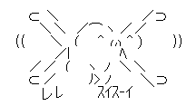
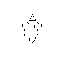
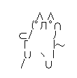

## 2I05市川敬士 12/07(THU)

# プログラミング応用

## 実験の目的

これまで講義では C++の基礎を中心に学んだ。また、工学実験では講義に関連した基礎演習のほか、
Windows プログラミングの基礎技術に関して演習をした。今回の実験では、Windows アプリケーションの
作成を通して、以下を目的とした演習を実施する。
- これまで学んだ知識・技術を総合的に活用すること
- これまでの知識を用いて、与えられたソースコードを理解すること
- デザインパターンやフレームワークの基礎知識を身に付けること
- クラス図の基礎知識を身に付けること

## 実験の概要

簡単なシューティングゲームを開発する。その仕様は次のとおりである。（仕様の不足分は各自で決めること。）
- ウィンドウサイズ
    - 横 800pixel、縦 600pixel
- 自機
    - 前後左右に平行移動する。
    - 画面中に最大 10 発までのミサイルを前方に向けて撃つことができる。
    - 敵機かミサイルに当たると消滅する。
- 敵機
    - 画面中に 5 機まで存在する。
    - 計算により移動経路を求める。
    - 画面中に 1 発のミサイルを前方に向けて撃つことができる。
    - 敵機以外に当たると消滅する。
- ミサイル
    - 直進的に移動する。
    - 他の飛行物体と当たると消滅する。

## 考察

### 1. 
- 内容

クラス Fighter の列挙型 DIRECTION の列挙子の値を$2^n$にしている目的を述べよ。

- 回答

GUI2でもそうだったようにそれぞれの操作によって変化する値同士で1になるbitの番目が異なるため、同時に別の動作を行われていたとしても調べたいもののbitを調べれば、どのような動作が行われているかを簡潔に調べることができる。

### 2. 

- 内容

メルセンヌ・ツイスターについて調査し、特徴をまとめよ。


- 回答

    - 擬似乱数列生成器の一種であり、コンピュータでランダムな数列を作るためのアルゴリズムのことです。  
    メルセンヌ・ツイスターの周期は$2^{19927}-1$であり、これはメルセンヌ素数と呼ばれる特殊な素数で、名前の由来にもなっています。
    - 623次元まで均等分布することが証明されています。
    - 簡単なビット演算と加算、剰余を使って数列を生成するため、高速に生成することができます。

### 3. 

- 内容

```cpp
void Missile::fire(double x, double y, double vx, double vy)
{
    this->x = x;
    ・・・
}
```
において、this->をつける理由を述べよ

- 回答


### 4. 

- 内容

```cpp
constexpr int N_ENEMY_A = 2; // 定数式（C++11 以降）
```
或いは
```cpp
#define N_ENEMY_A 2 // マクロ（C, C++すべて）
```
のように、インスタンスの個数を定数式やマクロで定義するメリットを説明せよ。

- 回答
    - 変数で値を保存することで、何の値を持つものか一瞬でわかるようになっている。
    - ここの値の変更によって別のコードを変更する必要はなくなる。

### 5. 

- 内容

クラス FlyingObject のメンバ関数 draw()などには、virtual を付けている。  
1. virtual がついているメンバ関数を何と呼ぶか。  
2. virtual が必要な理由を述べよ。  
3. virtual がないと、第 13 章の 2 の処理において、どのような不具合が起こるか説明せよ。  

- 回答

1. 純粋仮想関数
2. 
3. 

### 6. 

- 内容

第14章1.bの 
```cpp
void Fighter::shoot()
```
の動作を説明せよ。

- 解答


### 7.

- 内容

```cpp
std::vector<FlyingObject*> ShootingApp::fo;
```
```cpp
std::vector<Enemy*> ShootingApp::enemies;
```
などを作成した理由を述べよ。

- 解答


### 8.

本来は敵機を倒したとき、敵機の点数（Enemy::point）に設定した値がスコア（Score::score）に加算されるべきである。しかし、第15章5.cの方法では、そのようになっていない。
1. 第15章5.cでは、どのようにスコアに加算されているか説明せよ。
2. 本来の加算方法にするには、どうしたらよいか述べよ。（ソースコードは不要。方針を述べるだけでよい。）

- 解答

1. 
2. 

## クラスEnemyBの宣言と定義及び説明

- 宣言(EnemyB.h)

```cpp
#pragma once
#include "Enemy.h"
#include "ShootingApp.h"

class EnemyB : public Enemy
{
private:
	double phase;
public:
	EnemyB();
	~EnemyB();

	void init();
	void update();
	void draw();
};
```

- 定義(EnemyB.cpp)
```cpp
#define _USE_MATH_DEFINES	// Visual C++でM_PIを使えるように
#include <cmath>
#include "EnemyB.h"

EnemyB::EnemyB() : Enemy()
{
}


EnemyB::~EnemyB()
{
}

void EnemyB::init()
{
	FlyingObject::init();

	phase = App::rand() * M_PI;	// M_PIはπ

	x = 100 + 500 * App::rand();
	y = 100 + 200 * App::rand();

	vx = 100 + 200 * App::rand();
	vy = 100 + 200 * App::rand();

	ax = 0.5;
	ay = 0.2;

	radius = 30;
	score = 100;
}

void EnemyB::update()
{
	if (status & COLLISION) {
		if (etimer.get() > 0.5) {
			cleanup();
		}
		return;
	}
	double dt = elapsed.get();
	double mt = mtimer.get();
	double dx, dy;

	// updateの間隔が長すぎるときは、強制的にdtを設定
	if (dt > 1.0 / 30) {
		dt = 1.0 / 30;
	}

	if (vx == 200) {
		ax = -0.5;
	}
	else if (vx == 100) {
		ax = 0.5;
	}

	if (vy == 100) {
		ay = -0.2;
	}
	else if (vy == 100) {
		ay = 0.2;
	}
	
	vx += ax;
	vy += ay;

	dx = vx * sin(2 * mt + phase) * dt;
	dy = vy * cos(5 * mt + phase) * dt;

	x += dx;
	y += dy;

	elapsed.reset();
}

void EnemyB::draw()// 後で自分の好きな形に変更する
{
	if (status & COLLISION) {
		drawExplosion();
		return;
	}
	LPCWSTR c = TEXT("△");
	TextOut(App::hDC, (int)x + 10, (int)y - 27, c, lstrlen(c));
	c = TEXT("( ﾟдﾟ)");
	TextOut(App::hDC, (int)x - 6, (int)y - 10, c, lstrlen(c));
	c = TEXT("( 　)");
	TextOut(App::hDC, (int)x - 3, (int)y + 4, c, lstrlen(c));
	c = TEXT(")ノ");
	TextOut(App::hDC, (int)x + 7, (int)y + 18, c, lstrlen(c));
}
```

- 説明
```

```

## クラスScoreの宣言と定義及び説明

- 宣言(Score.h)

```cpp
#pragma once
#include "App.h"
class Score
{
private:
	int score;
public:
	void init();
	void addScore(int score);
	void draw(int x,int y);
};
```

- 定義(Score.cpp)
```cpp
#include "Score.h"
#include <string>

void Score::init() {
	score = 0;
}

void Score::addScore(int score) {
	Score::score += score;
}

void Score::draw(int x,int y) { 
	TCHAR ScoreBord[64];
	wsprintf(ScoreBord,TEXT("%05d"), score);
	TextOut(App::hDC, x, y, ScoreBord, lstrlen(ScoreBord));
}
```

- 説明
```

```

## 応用課題のソースコード(変更箇所のみ)と説明(※応用課題の実施は任意でよい。)

## 最終作品のクラス図

- 属性・操作を省略してよい。
- 関係は、汎化・集約・コンポジションのみでよい。

## いくつかのスクリーンショット






## 感想(100字以上)


